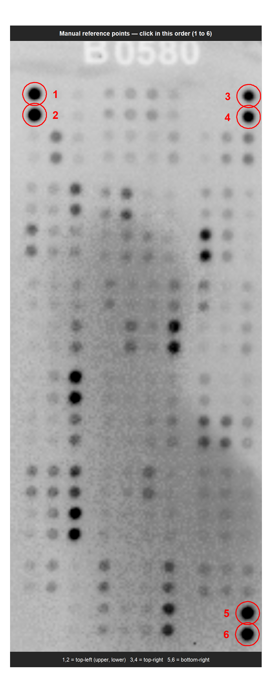
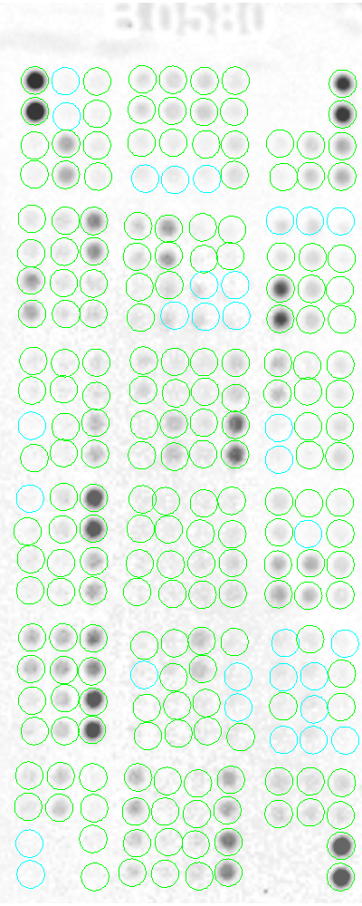

# cytoarray

Measure membrane cytokine arrays in R. Put your TIFF images in one folder;
cytoarray writes intensity tables and spot-check images to another folder.
The R&D Systems Mouse XL Cytokine Array (ARY028) layout is included.

To request support for another array, please contact Junhao Wang
(junhao.wang.research@gmail.com) with a scanned raw image and the kit catalog number.

## Install

Use R >= 4.1. Unzip the download, then run:

```r
if (!requireNamespace("BiocManager", quietly = TRUE)) install.packages("BiocManager")
BiocManager::install(c("EBImage", "limma"), update = FALSE, ask = FALSE)
install.packages(c("statmod", "remotes"))
BiocManager::install("JH-42/cytoarray")
library(cytoarray)
```

## Run your images

Use one `.tif` or `.tiff` per membrane. Change `input` and `output` below, then
run in RStudio. No template file is needed for ARY028.

```r
library(cytoarray)
input <- "path/to/membrane_images"
output <- "path/to/array_results"
arr <- run_arrays(input, output, ref_mode = "manual", refine = "both")
print(qc_table(arr))
saveRDS(arr, file.path(output, "quantification.rds"))
```

This processes all TIFFs. To process just one, add `include = "ctrl_1.tif"` to
`run_arrays()`. Keep `input` as the folder, not the image file.
You can also open the [starter script](inst/examples/01_quantify_arrays.R),
edit its two folder paths, then click **Source**.

## Click and check

Click six reference centres: top-left upper/lower, top-right upper/lower,
then bottom-right upper/lower. Automatic refinement runs next. To correct a
spot manually, click its circle, then its correct centre. End with Esc or
right-click, as supported by your R graphics device.

<table>
<tr>
<td align="center"><br>Click the six reference spots in order.</td>
<td align="center"><br>Inspect and correct the spot positions.</td>
</tr>
</table>

Circle colours:

- **Green**: position adjusted automatically or manually.
- **Cyan**: other measured spots without position adjustment.
- **Orange**: high-intensity spots without position adjustment.
- **Red**: missing measurement.
- **Magenta**: the spot currently selected during manual adjustment.

Colours indicate processing status, not statistical significance.

Check the verification images and QC table before using the intensity tables.
To redo one membrane, run `arr <- remanual(arr, ids = "ctrl_1")` and save it again.
See the [short guide](GETTING_STARTED.md) for outputs and settings.

## Compare groups

For quantification plus group comparisons, open the
[complete workflow](https://github.com/JH-42/cytoarray/blob/main/inst/examples/02_complete_workflow.R). Edit the two folders,
sample-to-group labels and control name at the top. Sample IDs must match image
file names without the extension. Inspect the overlays before continuing.

```r
M <- intensity_matrix(arr)
group <- c(ctrl_1 = "ctrl", ctrl_2 = "ctrl", ctrl_3 = "ctrl",
           treatA_1 = "treatA", treatA_2 = "treatA", treatA_3 = "treatA",
           treatB_1 = "treatB", treatB_2 = "treatB", treatB_3 = "treatB")
res <- diff_array(M, group, control = "ctrl")
write.csv(res, file.path(output, "group_comparisons_all.csv"), row.names = FALSE)
```

One call compares all treatment groups against the same control. The complete script
saves full results plus an FDR < 0.05 table for each treatment.
Use independent biological samples; a single pooled membrane per group supports
descriptive fold changes only. See the [guide](https://github.com/JH-42/cytoarray/blob/main/GETTING_STARTED.md#5-compare-groups).

## Help

Use `?run_arrays` for settings and `?diff_array` for comparison options.

Author: Junhao Wang. License: [GPL-3](https://github.com/JH-42/cytoarray/blob/main/LICENSE.md).
